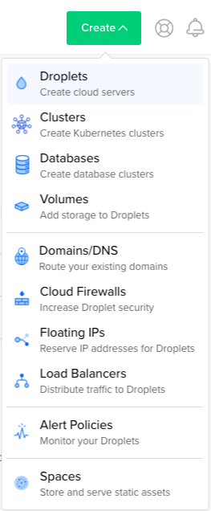

## Sample project featuring undertow integrated with Spring and Swagger

### Step 1 Adding Swagger to our Project

[Swagger](https://swagger.io/about/) is the reference implementation where the [OpenAPI Specification](https://www.openapis.org) was founded and subsequently donated to the Linux foundation. 
Working with Swagger and Spring is not hard, but it requires a little configuration.

First we need to add [SpringFox](https://github.com/springfox/springfox) to our maven project, adding the following
dependencies to our pom.xml:

```
        <dependency>
            <groupId>io.springfox</groupId>
            <artifactId>springfox-swagger2</artifactId>
            <version>2.9.2</version>
        </dependency>

        <dependency>
            <groupId>io.springfox</groupId>
            <artifactId>springfox-swagger-ui</artifactId>
            <version>2.9.2</version>
        </dependency>

```

Next step is to add the following configuration class to our project:

```java
@Configuration
@EnableSwagger2
public class SwaggerConfig {

    @Bean
    public Docket api() {
        return new Docket(DocumentationType.SWAGGER_2)
                .select()
                .apis(RequestHandlerSelectors.any())
                .paths(PathSelectors.any())
                .build();
    }
}
```

Because we are not using Spring Boot which was automatically getting the necessary files and show the
Swagger UI, we need to register a resource handler for the files. The configuration for this, 
is the following class:

```java
@EnableWebMvc
@Configuration
public class MvcConfig implements WebMvcConfigurer {

    @Override
    public void addResourceHandlers(ResourceHandlerRegistry registry) {
        registry.addResourceHandler("swagger-ui.html").addResourceLocations("classpath:/META-INF/resources/");
        registry.addResourceHandler("/webjars/**").addResourceLocations("classpath:/META-INF/resources/webjars/");
    }
}
```

### Step 2 Looking at Swagger

On restarting our application we will now have some new endpoints. 
The first represents the swagger specification of our application.

[http://localhost:8080/v2/api-docs](http://localhost:8080/v2/api-docs)


The second represents the Swagger UI, which we can now use to invoke and explore our API.

[http://localhost:8080/swagger-ui.html](http://localhost:8080/swagger-ui.html)


### Step 3 More documentation

There are some other annotations that can be used to add further documentation to our code.

`@Api` - can sit at the top of the controller to give more information on the overall controller.  
`@ApiOperation` - can be used on the methods to provide more documentation

Experiment with those two annotations and see if you can produce a page that looks like the following.


### Step 4 Generate a Client

The advantage of having the swagger specification available is generating client code to call our API is now quite easy.
[http://localhost:8080/v2/api-docs](http://localhost:8080/v2/api-docs) represents our current API specification.
 
First, download [Swagger Codegen](https://github.com/swagger-api/swagger-codegen)

```
wget http://central.maven.org/maven2/io/swagger/swagger-codegen-cli/2.3.1/swagger-codegen-cli-2.3.1.jar -O swagger-codegen-cli.jar   
java -jar swagger-codegen-cli.jar help
```
On a mac you can also run `brew install swagger-codegen`. 
After you have downloaded `swagger-codegen` run the following command against your API specification. 

```
java -jar swagger-codegen-cli.jar generate \
  -i http://localhost:8080/v2/api-docs\
  -l java \
  -o com/jpgough/workshop/java
```

This will generate a Java client that you can now experiment with calling your API.

There are many generators that are available, though you have to be careful that if you use one you do check the code generated.
Code generation has the potential to inject malicious code if it is not from a trusted source. 
The are also some generators that build nicer Spring Boot projects [here](https://www.baeldung.com/spring-boot-rest-client-swagger-codegen).

Build a small Java command line app that operates with your Todo API.

## Docker deployment with Digital Ocean (optional)
### Docker install and sign up
 For this, we need to install Docker. Let's first create a Docker account (in order to upload our image)
 
 * To create a Docker account visit the following website and register: https://hub.docker.com/signup
 
 * Next depending on your system you will need to choose the Docker version to install
   
   * Visit [Docker Desktop download page](https://www.docker.com/products/docker-desktop) and choose the Docker version to install (Mac or Windows).
 
     * Follow the first step to download Docker for your operating system
       * Windows run the EXE file
       * Mac run the DMG file
     * If you wish continue with the rest of the docker guide, however, it is not important
     
 * Login into Docker Desktop application using newly created account.
 
 * Go to the previously cloned project pom.xml path and build the project with the following command : ```mvn clean install```
 * Create a file and name it ```Dockerfile``` without any exstension.
 * Populate the newly created empty file ```Dockerfile``` with the following code :  
 ``` # Start with a base image containing Java runtime
     FROM openjdk:8-jdk-alpine
     
     
     # Add a volume pointing to /tmp
     VOLUME /tmp
     
     # Make port 8080 available to the world outside this container
     EXPOSE 8080
     
     # The application's jar file
     ARG JAR_FILE=target/uber-undertow-spring-web-1.0.0-SNAPSHOT.jar
     
     # Add the application's jar to the container
     ADD ${JAR_FILE} uber-undertow-spring-web.jar
     
     # Run the jar file
     ENTRYPOINT ["java","-Djava.security.egd=file:/dev/./urandom","-jar","/uber-undertow-spring-web.jar"] 
 ``` 
 * In the same path run the following docker command in order to build the docker image :  
 ```docker build -t image_name .```
 * In the same path run the newly created image with the following command(for testing purposes, locally) :  
 ```docker run -p 8080:8080 image_name:latest```
 * In order to push the docker image to a docker repository, first we have to login : ```docker login```
 * After login in, tag the image and push it to docker repository with the following command :  
 ```docker tag image_name:latest docker_username/image_name:latest```  
 ```docker push docker_username/image_name:latest```

#### Digital Ocean prerequisites
 ###### This section describes how to set up a fully functioning server on DigitalOcean in less than 20 minutes.
 
 ###### In the following procedure you will connect to your Droplet with SSH, and manually install all required dependencies.
 ###### DigitalOcean is an easy-to-use provider of virtual servers. They offer configurable compute units of various sizes, called Droplets.
* Visit [Digital Ocean Website](https://www.digitalocean.com/.) and Sign Up.
* After Sign-In, in order to create a Droplet click Create -> Droplets. Default configurations of the droplet can be changed if it's required.  
                   
* Create Droplet.
* After the Droplet is created you will receive and email where IP Address,Username and Password is specified.
* Create a ssh connection by executing the following unix command :  
    ```ssh username@IPAddress```  
* You will be asked to provide the password received via e-mail. After that you can change it.              
* After you are connected, create a new shell script file, using the following command :  
 ```vi install-docker.sh```
 and paste the following code : 
  ``` sudo apt-get update  
    sudo apt-get install \
        linux-image-extra-$(uname -r) \
        linux-image-extra-virtual
    sudo apt-get install \
            apt-transport-https \
            ca-certificates \
            curl \
            software-properties-common
    curl -fsSL https://download.docker.com/linux/ubuntu/gpg | sudo apt-key add -
    sudo apt-key fingerprint 0EBFCD88
    sudo add-apt-repository \
       "deb [arch=amd64] https://download.docker.com/linux/ubuntu \
       $(lsb_release -cs) \
       stable"
    sudo apt-get update
    sudo apt-get install docker-ce
    ```
* Give the newly created script execution rights by executing the following unix command :  
```chmod +x install-docker.sh```
* Run the newly created script :  
```sudo ./install-docker.sh```
* Verify the docker installation by running the hello world image :    
 ```sudo docker run hello-world```
 
### Digital Ocean deployment 
* Create a new ssh connection if the old connection to the Digital Ocean Droplet is not opened anymore.  
  ```ssh username@IPAddress```
* Pull the image previously pushed into docker repository and run it with the following commands :  
```docker pull docker_username/image_name:latest```  
```docker run -p 8080:8080 docker_username/image_name:latest```
* Test if the the deployment was successful by accessing the following address : http://localhost:8080 in any desired browser.

> Conclusion : Now we have our sample web application dockerized and pushed to a docker repository. Any system with a docker client installed can pull this docker image and run the web application instantly.