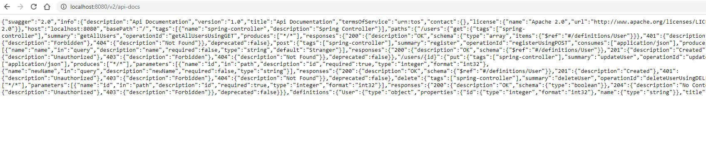
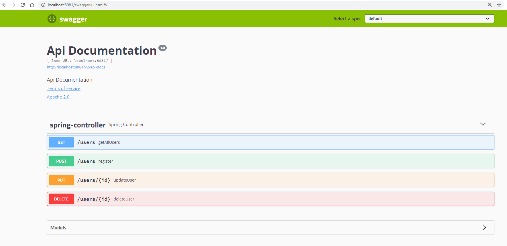
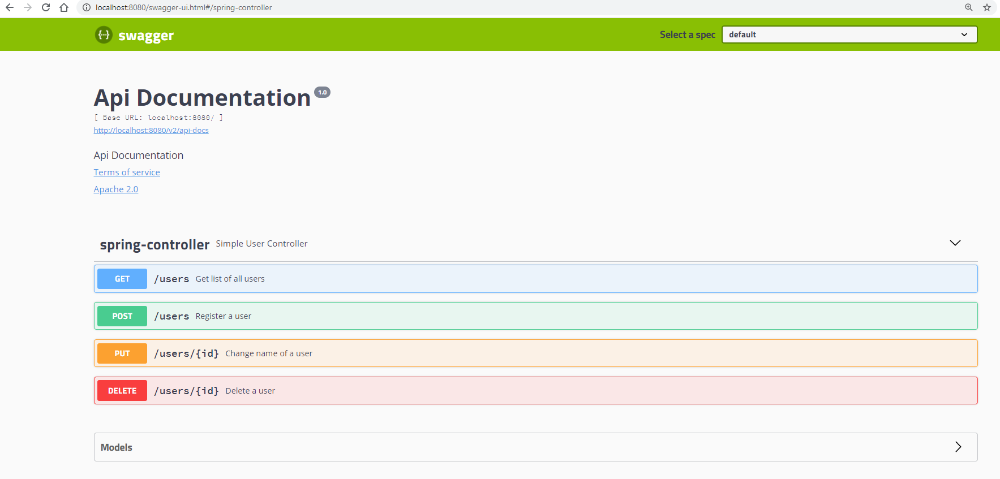

## Sample project featuring undertow integrated with Spring and Swagger

### Step 1 Adding Swagger to our Project

[Swagger](https://swagger.io/about/) is the reference implementation where the [OpenAPI Specification](https://www.openapis.org) was founded and subsequently donated to the Linux foundation. 
Working with Swagger and Spring is not hard, but it requires a little configuration.

First we need to add [SpringFox](https://github.com/springfox/springfox) to our maven project, adding the following
dependencies to our pom.xml:

```
        <dependency>
            <groupId>io.springfox</groupId>
            <artifactId>springfox-swagger2</artifactId>
            <version>2.9.2</version>
        </dependency>

        <dependency>
            <groupId>io.springfox</groupId>
            <artifactId>springfox-swagger-ui</artifactId>
            <version>2.9.2</version>
        </dependency>

```

Next step is to add the following configuration class to our project:

```java
@Configuration
@EnableSwagger2
public class SwaggerConfig {

    @Bean
    public Docket api() {
        return new Docket(DocumentationType.SWAGGER_2)
                .select()
                .apis(RequestHandlerSelectors.any())
                .paths(PathSelectors.any())
                .build();
    }
}
```

Because we are not using Spring Boot which was automatically getting the necessary files and show the
Swagger UI, we need to register a resource handler for the files. The configuration for this, 
is the following class:

```java
@EnableWebMvc
@Configuration
public class MvcConfig implements WebMvcConfigurer {

    @Override
    public void addResourceHandlers(ResourceHandlerRegistry registry) {
        registry.addResourceHandler("swagger-ui.html").addResourceLocations("classpath:/META-INF/resources/");
        registry.addResourceHandler("/webjars/**").addResourceLocations("classpath:/META-INF/resources/webjars/");
    }
}
```

### Step 2 Looking at Swagger

On restarting our application we will now have some new endpoints. 
The first represents the swagger specification of our application.

[http://localhost:8080/v2/api-docs](http://localhost:8080/v2/api-docs)



The second represents the Swagger UI, which we can now use to invoke and explore our API.

[http://localhost:8080/swagger-ui.html](http://localhost:8080/swagger-ui.html)



### Step 3 More documentation

There are some other annotations that can be used to add further documentation to our code.

`@Api` - can sit at the top of the controller to give more information on the overall controller.  
`@ApiOperation` - can be used on the methods to provide more documentation

Experiment with those two annotations and see if you can produce a page that looks like the following.




### Step 4 Generate a Client

The advantage of having the swagger specification available is generating client code to call our API is now quite easy.
[http://localhost:8080/v2/api-docs](http://localhost:8080/v2/api-docs) represents our current API specification.
 
First, download [Swagger Codegen](https://github.com/swagger-api/swagger-codegen)

```
wget http://central.maven.org/maven2/io/swagger/swagger-codegen-cli/2.3.1/swagger-codegen-cli-2.3.1.jar -O swagger-codegen-cli.jar   
java -jar swagger-codegen-cli.jar help
```
On a mac you can also run `brew install swagger-codegen`. 
After you have downloaded `swagger-codegen` run the following command against your API specification. 

```
java -jar swagger-codegen-cli.jar generate \
  -i http://localhost:8080/v2/api-docs\
  -l java \
  -o com/jpgough/workshop/java
```

This will generate a Java client that you can now experiment with calling your API.

There are many generators that are available, though you have to be careful that if you use one you do check the code generated.
Code generation has the potential to inject malicious code if it is not from a trusted source. 
The are also some generators that build nicer Spring Boot projects [here](https://www.baeldung.com/spring-boot-rest-client-swagger-codegen).

Build a small Java command line app that operates with your Todo API. 